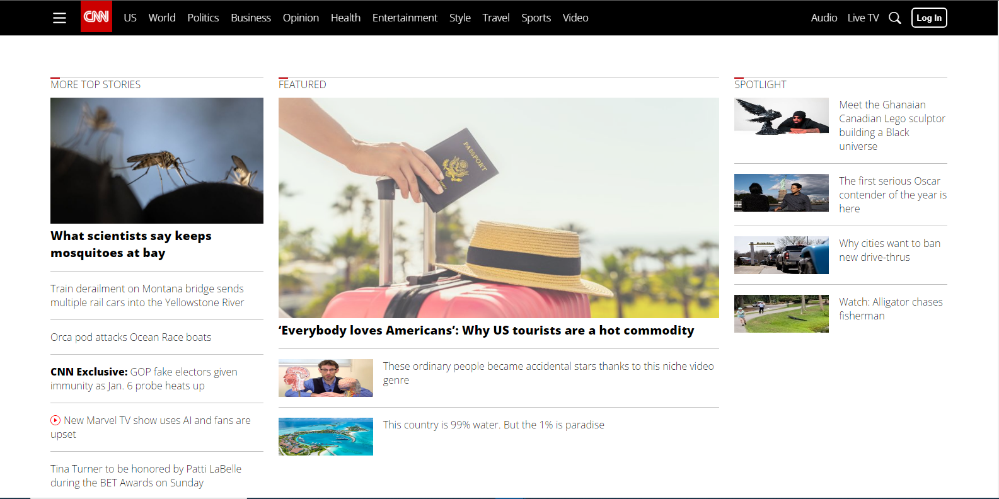
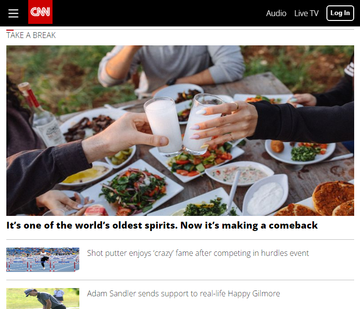

# CNN Clone

The CNN Clone is a web application that replicates the look and feel of the Cable News Network [(CNN)](https://edition.cnn.com) website. It serves as a practice project for improving web development and design skills, including HTML, CSS, and JavaScript.

## Features

- **Homepage:** Mimics the CNN homepage layout with sections for top news stories, latest updates, and featured articles.
- **Responsive Design:** Ensures that the website is accessible and user-friendly on various screen sizes, from desktop to mobile devices.
- **Article Pages:** Displays full articles with images, text, and links to related stories.

## Languages Used

- HTML5
- CSS3 (including Flexbox and media queries)
- JavaScript (for interactive features)

## Challenges Encountered and Known Challenges

- The design was hard to replicate
- The responsive design isn't perfect
- The news are not up to date and they don't use a news api to keep them updated

## How to install and Run the project

- Fork the repository and clone to your local machine
```bash
  git clone <repo>
```
- Redirect to the cloned project folder
- On your browser locate the index.html file or use live server

## Demo

<br>



**[Live Demo](https://bemdoom-cnn-clone.vercel.app)**

## 👨‍💻Author

**[Bemdoo Maor](https://github.com/MaorBemdoo)**

## Contributing

Future Pull request and issues are welcome

## Support

Give this repo a ⭐ if you liked it

## LICENSE

This repository is licensed under [MIT](LICENSE) License